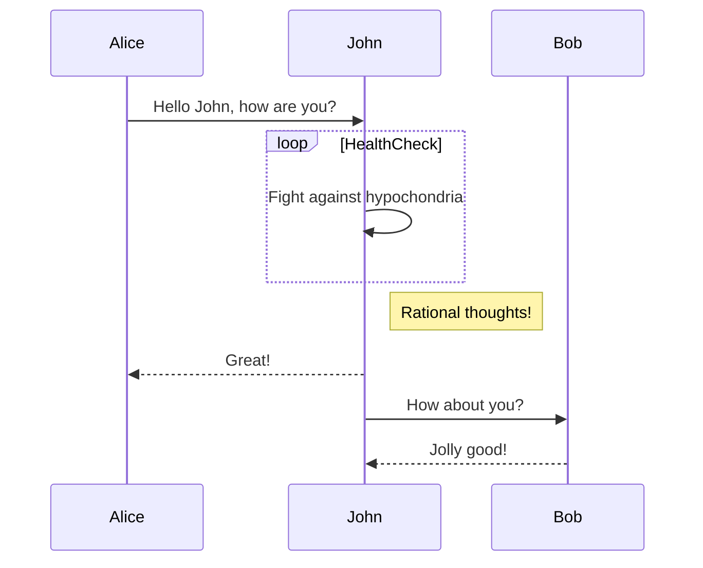

# MercuriusPayments
The idea is to implement a PSP that follows and agrees with the Banco Central Pix rules, the mediator and point of contact with the RSFN, the network where our pix (instant payment service on Brazil) transactions in effect runs.

